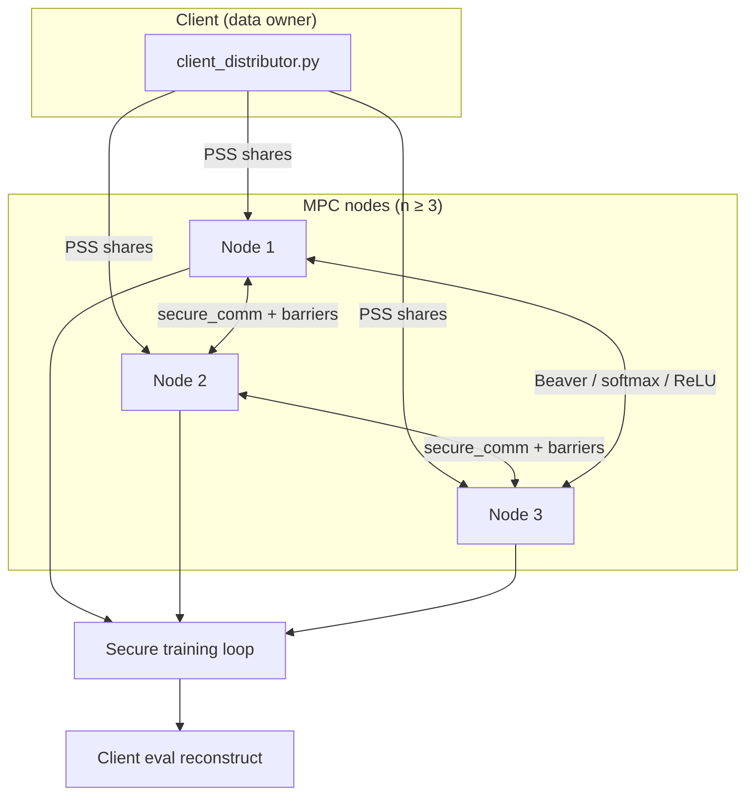

# SENTRA

**Secure, distributed machine learning** over secret-shared data with multi-party computation (MPC), Intel SGX enclaves, and client-side data ownership.

Train a model without any single party holding the full dataset in the clear. A **client** secret-shares MNIST features and labels to **compute nodes**; nodes run secure forward/backward passes with Beaver triples, secure comparison (ReLU), and fixed-point softmax approximations.

---

## Features

| Area | Capabilities |
|------|----------------|
| **Privacy** | Packed Shamir secret sharing; labels stay with the client in `with-client` mode |
| **MPC** | Secure matmul, ReLU, division, softmax (Padé exp), gradient clipping |
| **Resilience** | Dropout/join recovery (DPSS), versioned KVS, failure detection |
| **TEE** | Optional SGX/Occlum via Docker (`benchmarking/ml-benchmark`) |
| **Evaluation** | Reproducible benchmarks vs CrypTen; `[BENCHMARK]` timing instrumentation |

**Gradient modes**

| Mode | Use |
|------|-----|
| `secure_approx` | Protocol-compliant SENTRA path (default for published results) |
| `opened_exact` | Ablation only — opens logits at prover, then re-shares |

---

## Repository layout

```
sentra2/
├── sentra-node/          # Core stack: Python MPC + Rust node (Occlum/SGX)
│   └── python/
│       ├── node/         # Training, ml_training/, start_all_nodes.py
│       └── client/       # client_distributor.py
├── benchmarking/         # Docker benchmarks, CrypTen baseline, thesis metrics (incl. mnist.npz)
├── sentra-deployment/    # Compose / swarm deployment manifests
├── documentation/        # Sphinx docs, usage guide, design notes
└── run_mnist_plaintext.py  # Single-process plaintext baseline (same MLP shape)
```

| Path | Read me |
|------|---------|
| [`benchmarking/`](benchmarking/README.md) | **Start here** for Docker/SGX/CrypTen benchmarks |
| [`sentra-node/python/node/`](sentra-node/python/node/) | Local multi-process training |
| [`sentra-node/python/README.md`](sentra-node/python/README.md) | Detailed CLI flags, stability, Excel export |
| [`documentation/USAGE_GUIDE.md`](documentation/USAGE_GUIDE.md) | Runbook and log interpretation |

---

## Architecture



- **Field:** `2^61 − 1` with scale `2^16` (thesis / `with-client` profile).
- **Model:** MNIST MLP `784 → 128 → ReLU → 10`.
- **Prover:** One designated node performs selective openings inside training wall time.

---

## Quick start

### Option A — Docker benchmark (recommended)

Reproducible non-SGX and SGX runs with YAML configs and shared MNIST indices.

```bash
cd benchmarking/ml-benchmark
make build-ml
make run-with-client          # non-SGX
make sgx-run-with-client      # SGX / Occlum
```

Logs: `/workspace/node/logs/run_<timestamp>/` inside the container volume.  
See [`benchmarking/README.md`](benchmarking/README.md) for CrypTen, fault-recovery, and timing extraction.

### Option B — Local multi-process (WSL / Linux)

```bash
cd sentra-node/python/node
pip install -r requirements.txt

# Client-owned data (recommended)
python start_all_nodes.py --n-nodes 3 --base-port 9600 --headless \
  --receive-dataset-shares-from-client --start-client-distributor \
  --client-eval-after-training --client-eval-samples 100 --client-test-samples 100 \
  --num-epochs 10 --batch-size 64 --mnist-samples 10000 \
  --learning-rate 0.002 --loss-mode softmax \
  --field-size 2305843009213693951 --scale-factor 65536 \
  --softmax-temperature 2 --exp-approx pade22 \
  --softmax-grad-mode secure_approx --seed 2026
```

**MNIST data:** set `MNIST_NPZ_PATH` or place `mnist.npz` where [`ml_training/util.py`](sentra-node/python/node/ml_training/util.py) can find it (Docker images bake it at `/mnist.npz`).

### Option C — Plaintext baseline

Same topology and hyperparameters, no MPC overhead:

```bash
pip install -r sentra-node/python/node/requirements.txt
python run_mnist_plaintext.py --num-epochs 10 --batch-size 64 \
  --mnist-samples 10000 --learning-rate 0.002
```

---

## Benchmarking and evaluation

Primary comparison profile: **`with-client`** — 10k train samples, 10 epochs, batch 64, LR 0.002, 100 test samples.

| Document | Purpose |
|----------|---------|
| [`benchmarking/BENCHMARK_TIMING_COMPARISON.md`](benchmarking/BENCHMARK_TIMING_COMPARISON.md) | SENTRA vs SGX vs CrypTen timings, run IDs, fair workflow stages |
| [`benchmarking/SENTRA_EVALUATION.md`](benchmarking/SENTRA_EVALUATION.md) | Dissertation tables, analysis, LaTeX snippets |

```bash
# CrypTen baseline (Linux / WSL)
cd benchmarking/crypten-benchmark
python3 -m venv .venv && source .venv/bin/activate
make install && make run
```

---

## Testing

From `sentra-node/python/node`:

```bash
pip install -r requirements.txt
python -m pytest -q testing/test_forward_scaling.py testing/test_gradient_scaling.py
python -m pytest -q testing/test_batched_stage_invariants.py
```

Additional tests under `sentra-node/python/node/tests/` and `testing/`.

---

## Requirements

| Component | Version / notes |
|-----------|-----------------|
| Python | 3.10+ |
| OS | Linux or WSL for multi-process and CrypTen; Docker for packaged benchmarks |
| SGX | Intel SGX + Occlum for `sgx-run-*` targets (see `benchmarking/ml-benchmark/README.md`) |
| Dependencies | `sentra-node/python/node/requirements.txt` |

---

## Deployment

Core MPC training and the self-contained ML benchmark do not use the legacy
web demonstrator backend. The manifests below are a separate,
backend-assisted deployment path and require access to the private
`registry.tdp.trustworthy6g.net/tdp/sentra/sentra-backend:latest` image:

- [`sentra-deployment/docker-compose.yaml`](sentra-deployment/docker-compose.yaml)
- Node images: [`benchmarking/sentra-node/`](benchmarking/sentra-node/README.md)

See [`sentra-deployment/README.md`](sentra-deployment/README.md) for supported
profiles and prerequisites.

---

## Documentation

| Resource | Description |
|----------|-------------|
| [Usage guide](documentation/USAGE_GUIDE.md) | Commands, logs, troubleshooting |
| [Final status](documentation/FINAL_STATUS.md) | System capability matrix |
| [Sphinx docs](documentation/sphinx-doc-generation/) | Built on GitLab Pages from `main` (see `.gitlab-ci.yml`) |

---

## Common issues

| Symptom | Fix |
|---------|-----|
| Port in use | Change `--base-port` or stop stray `python` / node processes |
| `Broken pipe` / reset by peer | One node exited early — check `logs/run_*/node_*.log` |
| MNIST not found | Set `MNIST_NPZ_PATH` or use Docker image with baked `/mnist.npz` |
| WSL client `eval` wall time huge | Use `share_wait_sec` in logs for post-train eval, not full `eval` wall |

---

## Citation and reproducibility

For published runs, record: full CLI or YAML config, `seed`, `field-size`, `scale-factor`, `softmax-grad-mode`, and per-epoch metrics from `logs/run_<timestamp>/`.

---

<p align="center">
  <sub>SENTRA — secure distributed training research codebase</sub>
</p>
