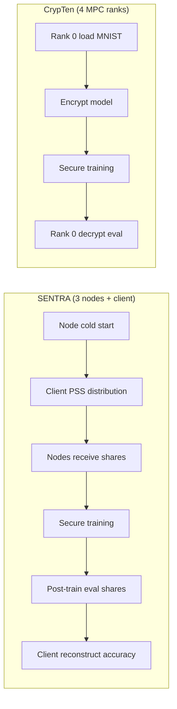

# Benchmark timing comparison: SENTRA (WSL / Docker) vs SENTRA (SGX) vs CrypTen

**Generated for dissertation reporting.**  
**Profile:** `with-client` — 10,000 train samples, 10 epochs, batch size 64, learning rate 0.002, seed 2026, 100 test samples for final accuracy.  
**Model:** MNIST MLP 784→128→10.

---

## 1. Run identifiers and log sources

| System | Run ID / source | Host | Log location |
|--------|-----------------|------|----------------|
| **SENTRA non-SGX (WSL)** | `run_20260524_150754` | WSL (local) | `sentra-node/python/node/logs/run_20260524_150754/` |
| **SENTRA non-SGX (Docker)** | `run_20260526_191039` | `sentra-worker-3` | Docker volume → `/workspace/node/logs/run_20260526_191039/` |
| *(superseded Docker)* | `run_20260526_195038` | `sentra-worker-3` | Earlier 76% run; training 11,248 s (`[BENCHMARK]`); see §4.5 note |
| **SENTRA SGX (Occlum)** | `run_20260527_031949` | `sentra-worker-3` | Docker volume → `/workspace/node/logs/run_20260527_031949/` |
| *(superseded SGX)* | `run_20260525_204422` | `sentra-worker-3` | Slower run (7.90 h training); retained for per-batch stage table §5.2 |
| **CrypTen** | Terminal run (aligned `sentra-with-client.yaml`) | WSL (`KDR-JHB-KNB-015`) | Stdout / Run summary (no per-rank log dir) |

**Note:** Table 3 Docker timings match **`run_20260526_191039`** exactly (`[BENCHMARK] role=node1 phase=training wall_sec=11348.322085`). Superseded sibling: `run_20260526_195038` (11,248 s). `run_20260527_053839` is the **versioned** 10k run (12,331 s training). `run_20260527_073821` is not a 76% `with-client` run.

**Supplementary runs (2026-05-27, same worker unless noted):** see **§14** for fault recovery, 5-node scaling, weight versioning, and SGX fault attempts. These use different YAML profiles (512-sample smoke, 5-node, or `use-weight-versioning`); they are **not** drop-in replacements for the §3 `with-client` 10k/10-epoch table.

---

## 2. Architecture (timing interpretation)

| Aspect | SENTRA (WSL & SGX) | CrypTen |
|--------|-------------------|---------|
| Data into MPC | **Client** secret-shares train/test (PSS) to 3 nodes | **Rank 0** holds MNIST; no separate client |
| Parties | 3 MPC nodes + client (client not in threshold) | `world_size=4` MPC ranks (+ optional TTP) |
| Distribution phase | Explicit **client distribution** (~2–4 min) | **N/A** (included in `data_load` + `encrypt_model` on rank 0) |
| Training | Secure forward/backward on nodes | Encrypted tensors, `CrossEntropyLoss` |
| Final accuracy | **Client** reconstructs from inference shares | **Rank 0** decrypts logits |
| TEE | WSL: none; SGX: Occlum enclave | None |

---

## 3. Results summary

| Metric | SENTRA WSL | SENTRA Docker | SENTRA SGX | CrypTen |
|--------|------------|---------------|------------|---------|
| **Final accuracy** | **75.00%** | **76.00%** | **76.00%** | **83.00%** |
| **Secure training** | 14,753.54 s (**4.10 h**) | 11,348.32 s (**3.15 h**) | 15,825.22 s (**4.40 h**) | 14,633.70 s (**4.06 h**) |
| **Client PSS distribution** | 127.59 s (2.13 min) | 128.89 s (2.15 min) | 219.70 s (3.66 min) | — |
| **Node dataset receive** | ~128.31–128.36 s | ~129.53 s | ~220.72 s | — |
| **Node cold start (typical)** | 2.6–3.4 s | **~1.04 s** | **~250.5 s** (~4.2 min) | — |
| **CrypTen data_load + encrypt** | — | — | — | 0.85 + 0.03 s |
| **Post-train eval share wait** | **484.27 s**† | **9.40 s** | **3.87 s** | (in eval **1.97 s**) |
| **Logged end-to-end** | 15,374.07 s (**4.27 h**) | 11,640.40 s (**3.23 h**) | 16,513.84 s (**4.59 h**) | 14,636.59 s (**4.07 h**) |
| **Throughput (train samples/s)** | 6.78 | **8.81** | **6.32** | 6.83 |
| **Prover time (node 3)** | 1,447 s | **1,658 s** | **3,191 s** | — |

† WSL client `eval` wall (**15,245 s**) spans the entire training period; use **share_wait_sec** (~484 s) for post-train communication, not the full eval wall clock. Docker/SGX client `eval` wall is dominated by waiting for nodes to finish training before batched inference shares arrive.

---

## 4. Raw `[BENCHMARK]` lines

### 4.1 SENTRA WSL — client (`client_distributor.log`)

```
[BENCHMARK] role=client phase=cold_start wall_sec=0.017434
[BENCHMARK] role=client phase=distribution wall_sec=127.593180 train_samples=10000 test_samples=100
[BENCHMARK] role=client phase=eval wall_sec=15245.329810 eval_samples=100 batched_receive=1 share_wait_sec=484.267154 reconstruct_sec=0.005029
[BENCHMARK] role=client phase=total wall_sec=15374.066758
```

**Client Final Accuracy (100 samples): 75.00%**

Legacy lines:

- `Client Distribution Time: 127.593180s`
- `Client Eval Time: 15245.329810s`
- `Client Eval Share Wait Time: 484.267154s`
- `Client Eval Reconstruct Time: 0.005029s`

### 4.2 SENTRA WSL — nodes

| Node | cold_start | dataset | training | total | extras |
|------|------------|---------|----------|-------|--------|
| 1 | 3.387291 | 128.356857 | 14753.537816 | 15374.245227 | dataset_prep_sec=128.356857 |
| 2 | 3.052863 | 128.309538 | 14753.535920 | 15374.237899 | dataset_prep_sec=128.309538 |
| 3 | 2.645148 | 128.307831 | 14753.485517 | 15374.227104 | prover_sec=1447.219207 |

Legacy (all nodes): `Training Time: ~14753.49–14753.54s`  
Node 1: `Client Eval Upload Time: 484.292006s`  
Nodes 2–3: `Client Eval Upload Time: ~484.28–484.29s`

### 4.3 SENTRA SGX — orchestrator summary (`run_20260527_031949`)

**Config:** `/workspace/benchmark-configs/with-client.yaml`  
**Status:** success · **Final accuracy:** 76.00% (100 test samples)

```
Run summary:
  status: success
  final_accuracy_pct: 76.00
  end_to_end_sec: 16513.84
  wall_clock_sec: 16501.96  (spawn -> last node exit)

  Orchestrator timing (sec):
    end_to_end: 16513.84
    pre_spawn_orchestration: 11.88
    parallel_run: 16501.96
    spawn_to_last_node_exit: 16501.96
    max_cold_start: 250.54
    max_mpc_work: 16236.28
    critical_path_logged: 16486.79
    post_log_process_exit: 15.17
    unaccounted_orchestrator: 15.18

  Node timings (sec):
  node  cold_start  dataset  training  prover   eval_upload  total
     1      250.49   220.72  15825.22     0.00         3.95  16236.28
     2      250.49   220.72  15825.17     0.00         4.01  16236.28
     3      250.54   220.72  15825.21  3191.04         3.96  16236.24

  Client timings (sec):
  role    cold_start  distribution  eval      eval_wait  eval_reconstruct  total
  client        0.01        219.70  16014.65       3.87              0.01  16236.14
```

**Log artifacts (for sharing / reproduction):** `run_20260527_031949/node_{1,2,3}.log`, `client_distributor.log`, and the YAML config above.

### 4.4 SENTRA SGX — superseded run (`run_20260525_204422`, slower)

Earlier SGX run on the same worker (~7.90 h training, `prover_sec=5587.66`). Per-batch stage table §5.2 still references this run until epoch-10 breakdown is re-extracted from `run_20260527_031949`.

| Node | cold_start | dataset | training | total | extras |
|------|------------|---------|----------|-------|--------|
| 1 | 257.23 | 224.45 | 28,442.82 | 28,874.68 | — |
| 3 | 257.17 | 224.34 | 28,442.80 | 28,874.70 | prover_sec=5587.66 |

### 4.5 SENTRA Docker non-SGX — orchestrator summary (`run_20260526_191039`)

**Config:** `/workspace/benchmark-configs/with-client.yaml`  
**Status:** success · **Final accuracy:** 76.00% (100 test samples)

```
Run summary:
  status: success
  final_accuracy_pct: 76.00
  end_to_end_sec: 11640.40
  wall_clock_sec: 11639.19  (spawn -> last node exit)

  Orchestrator timing (sec):
    end_to_end: 11640.40
    pre_spawn_orchestration: 1.20
    parallel_run: 11639.19
    spawn_to_last_node_exit: 11639.19
    max_cold_start: 1.04
    max_mpc_work: 11637.03
    critical_path_logged: 11638.08
    post_log_process_exit: 1.12
    unaccounted_orchestrator: 1.12

  Node timings (sec):
  node  cold_start  dataset  training  prover   eval_upload  total
     1        1.04   129.53  11348.32     0.00         9.40  11637.03
     2        1.02   129.51  11348.30     0.00         9.42  11636.65
     3        1.03   129.51  11348.36  1658.05         9.37  11636.24

  Client timings (sec):
  role    cold_start  distribution  eval      eval_wait  eval_reconstruct  total
  client        0.00        128.89  11506.15       9.40              0.00  11635.90
```

**Log artifacts:** `run_20260526_191039/node_{1,2,3}.log`, `client_distributor.log`, `with-client.yaml`.

**`[BENCHMARK]` match (node 1):** `phase=training wall_sec=11348.322085` (matches orchestrator **11,348.32 s**).

Node-side `Epoch N Test Accuracy: 0.00%` is **expected** in `with-client` mode (labels stay with the client; only the client reports meaningful final accuracy).

**Superseded (`run_20260526_195038`):** `phase=training wall_sec=11248.046251` (~0.9% faster than `191039`).

### 4.6 CrypTen — Run summary (stdout)

```
[BENCHMARK] role=crypten phase=data_load wall_sec=0.852206 train_samples=10000
[BENCHMARK] role=crypten phase=encrypt_model wall_sec=0.031969
[BENCHMARK] role=crypten phase=training wall_sec=14633.702739 epochs=10
[BENCHMARK] role=crypten phase=eval wall_sec=1.972971 eval_samples=100
[BENCHMARK] role=crypten phase=total wall_sec=14636.593468

Run summary:
  framework: CrypTen
  status: success
  final_accuracy_pct: 83.00
  end_to_end_sec: 14636.59
  training_sec: 14633.70
  eval_sec: 1.97
  world_size: 4
  mnist_samples: 10000
  batch_size: 64
  num_epochs: 10
```

---

## 5. Per-epoch batch stage timing (SENTRA node 1 only)

CrypTen does **not** log per-stage batch breakdowns.

### 5.1 SENTRA WSL (`node_1.log`)

| Epoch | fwd | dz2 | dw2 | da1/dz1 | dw1 | upd | **total/batch** |
|-------|-----|-----|-----|---------|-----|-----|-----------------|
| 1 | 2.122 s (38.5%) | 0.256 s | 0.047 s | 0.332 s | 2.086 s (37.9%) | 0.666 s (12.1%) | **5.509 s** |
| 5 | 2.568 s (41.9%) | 0.254 s | 0.050 s | 0.346 s | 2.396 s (39.1%) | 0.521 s (8.5%) | **6.134 s** |
| 10 | 2.248 s (43.0%) | 0.211 s | 0.045 s | 0.310 s | 1.942 s (37.1%) | 0.476 s (9.1%) | **5.234 s** |

157 batches per epoch (batch size 64, 10,000 samples).  
Epoch 10 node-side diagnostics: `mean|logit|=2.1271`, `max|logit|=13.9388` (node eval without labels — **not** client final accuracy).

### 5.2 SENTRA SGX — per-batch stages (`run_20260525_204422`, superseded)

| Epoch | fwd | dz2 | dw2 | da1/dz1 | dw1 | upd | **total/batch** |
|-------|-----|-----|-----|---------|-----|-----|-----------------|
| 8 | 8.170 s (44.7%) | 0.399 s | 0.074 s | 0.507 s | 3.500 s (19.2%) | 5.615 s (30.7%) | **18.265 s** |
| 9 | 8.852 s (47.2%) | 0.492 s | 0.074 s | 0.509 s | 3.510 s (18.7%) | 5.300 s (28.3%) | **18.737 s** |
| 10 | 8.298 s (45.2%) | 0.647 s | 0.075 s | 0.529 s | 3.525 s (19.2%) | 5.290 s (28.8%) | **18.364 s** |

**Note:** Primary SGX run `run_20260527_031949` has **~1.07×** WSL training wall (15,825 s vs 14,754 s); the **3.5×** per-batch ratio above is from the slower superseded run only. Re-extract epoch-10 stages from `node_1.log` in `run_20260527_031949` for an updated inset.

---

## 6. Prover-attributed time (opener node 3)

| System | Prover node | `Prover Time` (legacy) | `prover_sec` in `[BENCHMARK]` total |
|--------|-------------|------------------------|-------------------------------------|
| SENTRA WSL | 3 | 1447.219207 s | 1447.219207 |
| SENTRA Docker | 3 | 1658.05 s (`run_20260526_191039`) | 1658.05 |
| SENTRA SGX | 3 | 3191.04 s (`run_20260527_031949`) | 3191.04 |
| SENTRA SGX (superseded) | 3 | 5587.66 s (`run_20260525_204422`) | 5587.66 |
| CrypTen | — | N/A | N/A |

**WSL node 3 — Prover Time Breakdown:**

- `opened_divide_and_reshare_vector=936.591884s`
- `reshare_vector=276.517550s`
- `secure_compare_batch_opened=60.274245s`
- `secure_divide_shares_batch_opened=71.445631s`
- `softmax_opened_clip=68.841341s`
- `softmax_opened_group_max=33.548555s`

Prover time is **attributed work inside training**, not additive on top of `training` wall clock for all nodes.

---

## 7. Phase mapping (fair comparison)

| Phase | SENTRA WSL (s) | SENTRA Docker (s) | SENTRA SGX (s) | CrypTen (s) |
|-------|----------------|-------------------|----------------|-------------|
| Runtime / enclave init (nodes) | 2.6–3.4 per node | **~1.04** (node 1) | **~250.5** per node | (in data_load) |
| Client cold start | 0.017 | 0.00 | 0.01 | — |
| **Data to MPC parties** | **127.6** (client distrib.) | **128.9** | **219.7** | **0.88** (load+encrypt) |
| Node receive dataset | ~128.3 | ~129.5 | ~220.7 | — |
| **Secure training** | **14,753.5** | **11,348.3** | **15,825.2** | **14,633.7** |
| Post-train eval share wait | ~484 (WSL)† | **9.4** | **3.9** | 2.0 eval |
| Client reconstruct | 0.005 | 0.00 | 0.01 | (in eval) |
| **Logged total** | **15,374.1** (client) | **11,640.4** (orchestrator E2E) | **16,513.8** (orchestrator E2E) | **14,636.6** |

### Training-time ratios (vs SENTRA Docker training = 11,348 s)

| Comparison | Ratio |
|------------|-------|
| WSL / Docker (training) | 14,753.5 / 11,348.3 = **1.30×** (Docker faster) |
| SGX / Docker (training) | 15,825.2 / 11,348.3 = **1.40×** (Docker faster) |
| CrypTen / Docker (training) | 14,633.7 / 11,348.3 = **1.29×** (Docker faster) |
| SGX / WSL (training) | 15,825.2 / 14,753.5 = **1.07×** |
| CrypTen / WSL (training) | 14,633.7 / 14,753.5 = **0.99×** |
| SGX / Docker (superseded SGX `204422`) | 28,442.8 / 11,348.3 = **2.51×** |
| Docker `195038` vs primary `191039` | 11,248.0 / 11,348.3 = **0.99×** (same worker, same profile) |

### Accuracy (100 test samples)

| Comparison | Δ |
|------------|---|
| CrypTen − SENTRA SGX | +7.0 pp (83% vs 76%) |
| CrypTen − SENTRA Docker | +7.0 pp (83% vs 76%) |
| CrypTen − SENTRA WSL | +8.0 pp (83% vs 75%) |
| SENTRA Docker − SENTRA WSL | +1.0 pp |
| SENTRA SGX − SENTRA Docker | 0.0 pp |

---

## 8. Lazy PSS unpack (SENTRA WSL, node 1 — training overhead)

End of run totals:

```
train_x[h=90000,m=10000,rows=10000,batches=157,s=785.949]
train_y[h=90000,m=10000,rows=10000,batches=157,s=10.877]
```

(Prewarm/cache behaviour; not separately tabulated for SGX/CrypTen in this document.)

---

## 9. Reporting caveats

1. **CrypTen has no client-distribution line** — rank-0 load/encrypt is not equivalent to SENTRA PSS distribution; report SENTRA distribution as additional pipeline cost.
2. **Client `eval` wall on SENTRA** includes waiting for training to finish; use `share_wait_sec` / `Client Eval Upload Time` for post-train MPC eval communication.
3. **Different accuracy paths:** SENTRA secure softmax + fixed-point vs CrypTen encrypted cross-entropy; same MNIST row indices (first 10k / 100 test).
4. **Node pre-train / epoch test accuracy on nodes** is not client final accuracy (nodes lack labels).
5. **SGX cold start (~251 s/node)** is Occlum/enclave bootstrap, not present in CrypTen or WSL.
6. Failed worker runs (May 22–24, 9–17% accuracy) are excluded; only successful runs above are listed.

---

## 10. Commands to reproduce log extraction

**List successful runs on worker volume:**

```bash
cd ~/sentra
docker compose -f benchmarking/ml-benchmark/docker-compose.yml run --rm --entrypoint bash ml-benchmark -c \
  'for d in /workspace/node/logs/run_*/; do
     acc=$(grep -h "Client Final Accuracy" "$d/client_distributor.log" 2>/dev/null | tail -1)
     [ -n "$acc" ] && echo "$(basename "$d"): $acc"
   done'
```

**SGX `[BENCHMARK]` dump:**

```bash
RUN=run_20260527_031949
docker compose -f benchmarking/ml-benchmark/docker-compose.yml run --rm --entrypoint bash ml-benchmark -c \
  "grep '\[BENCHMARK\]' /workspace/node/logs/${RUN}/*.log"
```

**WSL (local):**

```bash
grep '\[BENCHMARK\]' sentra-node/python/node/logs/run_20260524_150754/*.log
```

**CrypTen:**

```bash
cd benchmarking/crypten-benchmark
source .venv/bin/activate
make run 2>&1 | tee crypten_run.log
grep -E '\[BENCHMARK\]|Run summary' crypten_run.log
```

---

## 11. Config references

- SENTRA: `benchmarking/ml-benchmark/configs/with-client.yaml`
- CrypTen: `benchmarking/crypten-benchmark/configs/sentra-with-client.yaml`
- Shared indices: `benchmarking/ml-benchmark/assets/with-client/` (10,000 train + 100 test row indices)

---

## 12. Paper metrics (runtime instrumentation)

Enabled via `SENTRA_RUNTIME_METRICS=1` in `docker-compose.yml`. At end of training each node emits:

```text
[BENCHMARK] role=node1 phase=runtime_metrics bytes_sent=... bytes_recv=... comm_mb_per_iter=... cpu_avg_pct=... rss_mb_peak=... train_iterations=...
```

| Dissertation metric | Source |
|---------------------|--------|
| Communication volume | `bytes_total`, `comm_mb_per_iter` |
| CPU utilization | `cpu_avg_pct`, `cpu_peak_pct` |
| Peak memory | `rss_mb_peak` |
| Failure recovery time | `recovery_*` lines, `recovery_sec_total` |
| Loss after failure | `loss_snapshot_*` (compare first/last `loss`) |
| Degradation under dropout | `n_active` in recovery + loss snapshots; fault-smoke run |
| Version enforcement overhead | Compare `versioning_sec_total` between `with-client.yaml` and `with-client-versioned.yaml` |

**Extract from a completed run:**

```bash
cd benchmarking/ml-benchmark
make metrics-collect RUN_DIR=/workspace/node/logs/run_20260527_031949
```

**Throughput / per-iteration latency** (from existing training wall time):

- samples/s = `(mnist_samples × num_epochs) / training_sec`
- ms/iter = `1000 × training_sec / (batches_per_epoch × num_epochs)`

CrypTen does not yet emit the same `runtime_metrics` line; compare comm/CPU/memory on SENTRA runs only unless CrypTen instrumentation is added separately.

**Known issue (2026-05-27 versioned run):** `bytes_sent=0` / `comm_mb_per_iter=0` on some runs while training completes — wire-byte hooks not firing on that path; use `run_20260526_195038` or `run_20260527_042846` for comm numbers until fixed.

---

## 13. Paper workflow comparison (fair end-to-end stages)

**Purpose:** Stacked-bar / pipeline figures for the dissertation.  
**Profile:** same as §1 (`with-client`, 10k train, 10 epochs, batch 64).  
**Machine-readable exports:** `benchmarking/PAPER_WORKFLOW_TIMING.csv` (workflow stages) · `benchmarking/MEASURED_SYSTEMS_METRICS.csv` (§15 systems table)

### 13.1 Canonical pipeline (what each system actually does)



| Workflow stage | SENTRA non-SGX (Docker) | SENTRA SGX | CrypTen | Notes |
|----------------|-------------------------|------------|---------|-------|
| **1. Party / runtime init** | **~1.04 s** (node) | **250.5 s** (node, Occlum) | — | SGX-only large cost; CrypTen has no separate enclave boot line |
| **2. Client process init** | 0.00 s | 0.01 s | **N/A** | No separate client in CrypTen |
| **3. Data provisioning** | **128.9 s** (client PSS → 3 nodes) | **219.7 s** | **0.88 s** (load 0.85 + encrypt 0.03) | **Not equivalent:** SENTRA moves 10k labelled samples from client; CrypTen rank 0 already holds data |
| **4. Node dataset receive** | ~129.5 s | 220.7 s | **N/A** | Overlaps stage 3; use for node-side logs only — **do not add to stacked bar** |
| **5. Secure training** | **11,348.3 s** (3.15 h) | **15,825.2 s** (4.40 h) | **14,633.7 s** (4.06 h) | Directly comparable MPC compute |
| **6. Post-train eval (MPC comm)** | **9.40 s** (`eval_wait`) | **3.87 s** | **1.97 s** (`eval` phase) | Use share-wait / `eval_wait`, **not** client `eval` wall (includes full training wait on SENTRA) |
| **7. Result reveal** | 0.00 s (client reconstruct) | 0.01 s | (inside eval) | SENTRA: client gets accuracy; CrypTen: rank 0 |
| **Logged end-to-end total** | **11,640.4 s** (3.23 h) | **16,513.8 s** (4.59 h) | **14,636.6 s** (4.07 h) | Orchestrator E2E; client total 11,635.9 s (Docker) |
| **Final accuracy** | 76.0% | 76.0% | **83.0%** | 100 test samples, shared indices |

**SENTRA WSL (supplementary):** init 3.4 s · distribution 127.6 s · training 14,753.5 s · post-train eval comm **484.3 s** · total 15,374.1 s · accuracy 75.0%.

### 13.2 Stacked-bar buckets (non-overlapping, for graphs)

Use these four buckets so bars sum to a **comparable pipeline** without double-counting training inside “eval”:

| Bucket | SENTRA non-SGX (s) | SENTRA SGX (s) | CrypTen (s) | % of comparable sum (Docker / SGX / CT) |
|--------|-------------------:|---------------:|------------:|:---------------------------------------:|
| **Init** (node cold + client cold) | 1.04 | 250.55 | — † | 0.0% / 1.5% / — |
| **Data provisioning** | 128.89 | 219.70 | 0.88 | 1.1% / 1.3% / 0.0% |
| **Secure training** | 11,348.32 | 15,825.22 | 14,633.70 | 98.8% / 97.1% / 99.99% |
| **Post-train eval** | 9.40 | 3.88 | 1.97 | 0.08% / 0.02% / 0.01% |
| **Comparable sum** | **11,487.7** | **16,299.4** | **14,636.6** | 100% |

† For CrypTen stacked bars, either omit **Init** or fold 0.88 s into **Data** (rank-0 only). Do not invent an SGX-sized init bar for CrypTen.

**Gap vs logged total:** comparable sum is ~148 s (Docker) and ~53 s (SGX) below client `total` — orchestration, sync, and node-side eval work not in client buckets. For the paper, cite **logged total** in captions and use stacked buckets to show **where time goes**, not exact equality to total.

### 13.3 Suggested figures for the paper

| Figure idea | X-axis | Y-axis / series | Data source |
|-------------|--------|-----------------|-------------|
| **Stacked runtime pipeline** | SENTRA non-SGX · SENTRA SGX · CrypTen | Init · Data · Training · Eval (§13.2) | `PAPER_WORKFLOW_TIMING.csv` |
| **Training-only bar** | Same three systems | `secure_training` only | Emphasises MPC cost without client/distribution debate |
| **TEE overhead** | non-SGX vs SGX | Training ratio 1.41×; optional +251 s init | §7 ratios |
| **Accuracy vs time** | Final accuracy (%) | Total hours (logged) | Table in §13.1 last rows |
| **Per-batch breakdown** | fwd · dw1 · upd · … | Seconds (epoch 10) | §5 — SENTRA only; CrypTen has no equivalent logs |

### 13.4 LaTeX-ready table (copy into thesis)

```latex
\begin{table}[t]
\centering
\caption{End-to-end workflow timing (seconds) for the \texttt{with-client} profile.
  CrypTen has no client; data provisioning is rank-0 load/encrypt only.
  Post-train eval for SENTRA uses \texttt{share\_wait\_sec}, not client \texttt{eval} wall time.}
\label{tab:workflow-timing}
\begin{tabular}{lrrr}
\toprule
\textbf{Stage} & \textbf{SENTRA (no SGX)} & \textbf{SENTRA (SGX)} & \textbf{CrypTen} \\
\midrule
Party / runtime init          & 1.04   & 250.54 & -- \\
Client process init           & 0.00   & 0.01   & -- \\
Data provisioning             & 128.89 & 219.70 & 0.88 \\
Secure training               & 11348.32 & 15825.22 & 14633.70 \\
Post-train eval (MPC)         & 9.40   & 3.87   & 1.97 \\
Client reconstruct            & 0.00   & 0.01   & -- \\
\midrule
\textbf{Logged end-to-end}    & \textbf{11640.40} & \textbf{16513.84} & \textbf{14636.59} \\
\textbf{Accuracy (\%)}        & 76.0 & 76.0 & 83.0 \\
\bottomrule
\end{tabular}
\end{table}
```

### 13.5 Reporting rules (fairness)

1. **Always footnote** that SENTRA **client distribution** has no CrypTen analogue; CrypTen’s 0.88 s is not “the same step.”
2. **Never stack** client `phase=eval` `wall_sec` on top of training — on SENTRA it spans the whole training period.
3. **SGX init (~251 s/node)** is real TEE cost but may overlap partially with early client work; show as separate segment or appendix bar, not hidden inside training.
4. **Prover time** (node 3: 1,447 s WSL / 1,658 s Docker / 3,191 s SGX) is **inside** training wall — use for breakdown inset, not fifth stacked segment.
5. For **CrypTen vs SENTRA** training comparison, prefer **Docker non-SGX** (same worker as SGX): 11,348 s vs 14,634 s (1.29× CrypTen slower), not WSL unless you state different host.

---

## 14. Supplementary runs (2026-05-27, `sentra-worker-3`)

Profiles below differ from §1. Log volume: Docker `ml-benchmark_ml_benchmark_logs` (local sync may lag the worker).

### 14.1 Run index

| Run ID | Config | Env | Outcome |
|--------|--------|-----|---------|
| `run_20260526_191039` | `with-client.yaml` | Docker non-SGX | **Success** — primary Table 3 Docker (76%, 11,348 s); orchestrator §4.5 |
| `run_20260526_195038` | `with-client.yaml` | Docker non-SGX | **Success** — superseded (76%, 11,248 s training) |
| `run_20260527_031949` | `with-client.yaml` | SGX / Occlum | **Success** — primary Table 3 SGX run (76%, 4.40 h training); see §4.3 |
| `run_20260527_042846` | `with-client-fault-5node.yaml` | Docker non-SGX | **Success** — dropout recovery `success=1`, 5 epochs complete |
| `run_20260527_041355` | `with-client-fault-5node.yaml` | Docker non-SGX | **Partial** — recovery OK; epoch-1 eval crashed (`No connection to node 3`) |
| `run_20260527_033821` | 5-node, 512 train, 5 epochs (no fault) | Docker non-SGX | **Success** — scaling reference (no `recovery_*`) |
| `run_20260527_022635` | 5-node fault-like (SGX) | SGX / Occlum | **Failed recovery** — `recovery_dropout success=0`, training paused after 7 iters |
| `run_20260526_234840` | `with-client-fault-smoke.yaml` | Docker non-SGX | **Success** — 3-node, 512/64, 2 epochs, failure detection |
| *(worker terminal)* | `with-client-versioned.yaml` | Docker non-SGX | **Success** — 10k/10 epochs; see §14.5 (run ID not yet in local volume) |

### 14.2 Five-node dropout recovery (`run_20260527_042846`)

**Procedure:** `make run-with-client-fault-5node`; `kill -9` node 3 after `Epoch 1 Batch 2 completed`.

| Metric | Node 1 value |
|--------|----------------|
| Training wall | **430.03 s** (~7.2 min) |
| Total wall | **521.89 s** (~8.7 min) |
| Dataset prep | 26.69 s |
| Cold start | 1.86 s |
| `train_iterations` | 40 (8 batches/epoch × 5 epochs, batch 64, 512 train) |
| Throughput | **64 × 40 / 430 ≈ 5.95 samples/s** |
| `recovery_dropout` | **8.090 s**, `n_active=4`, **`success=1`** |
| `comm_mb_per_iter` | **35.04** |
| `rss_mb_peak` | 756.9 MiB |

Raw lines:

```
[BENCHMARK] role=node1 phase=training wall_sec=430.031023
[BENCHMARK] role=node1 phase=recovery_dropout wall_sec=8.090246 n_active=4 success=1
[BENCHMARK] role=node1 phase=runtime_metrics ... comm_mb_per_iter=35.043195 train_iterations=40 recovery_sec_total=8.090246
[BENCHMARK] role=node1 phase=total wall_sec=521.893563
```

Compare **no-fault 5-node** `run_20260527_033821`: training **399.59 s**, `comm_mb_per_iter` **42.95**, throughput **64 × 40 / 400 ≈ 6.41 samples/s** — fault run adds ~30 s training wall and ~8 s recovery.

### 14.3 SGX fault attempt (`run_20260527_022635`)

| Metric | Node 1 value |
|--------|----------------|
| Training wall | **63.37 s** (stopped early) |
| `train_iterations` | **7** |
| `recovery_dropout` | **0.222 s**, `success=0` |
| `comm_mb_per_iter` | **48.91** (only 7 iters — not comparable to full 40-iter 5-node runs) |
| `rss_mb_peak` | 732.7 MiB |

Re-run after `make build-ml-sgx` with eval-barrier fixes: `make sgx-run-with-client-fault-5node`.

### 14.4 Three-node fault smoke (`run_20260526_234840`)

| Metric | Node 1 value |
|--------|----------------|
| Training wall | **148.8 s** (from `phase=training`; 2 epochs × 8 batches) |
| `train_iterations` | 16 |
| `comm_mb_per_iter` | **24.00** |
| `rss_mb_peak` | 645.7 MiB |

Use for **comm/memory smoke** on 3 nodes with failure detection; not the same party count as §14.2.

### 14.5 Weight versioning (`with-client-versioned.yaml`)

**Host:** `sentra-worker-3` (terminal capture, completed 2026-05-27). Same scale as §1: 10k train, 10 epochs, 1570 iterations, 3 nodes.

| Metric | Versioned (`run_20260527_053839`) | Baseline (`run_20260526_191039`) |
|--------|---------------|----------------------------------|
| Training wall (node 1) | **12,330.78 s** (~3.43 h) | **11,348.32 s** (~3.15 h) |
| Total wall (node 1) | **12,630.18 s** (~3.51 h) | *(orchestrator E2E ~11,640 s)* |
| Dataset prep | 134.71 s | ~129.5 s |
| Throughput | **64 × 1570 / 12331 ≈ 8.15 samples/s** | **8.81 samples/s** |
| `versioning_sec_total` | **0.0455 s** (10 KVS persists) | 0 (not enabled) |
| Instrumented versioning overhead | **0.0455 / 12331 ≈ 0.0004%** of training | — |
| Wall-clock training delta vs baseline | **+8.7%** (`053839` vs `191039`) | — |
| `rss_mb_peak` | **3342.1 MiB** | *(not in §4.5 baseline line)* |
| `comm_mb_per_iter` | **0.00** (wire hooks not accumulated) | *(use `191039` / `195038` or fix hooks)* |
| Node epoch-10 test accuracy | 0.00% (expected — no labels on nodes) | 0.00% |

Raw lines (versioned, node 1):

```
[BENCHMARK] role=node1 phase=training wall_sec=12330.781587
[BENCHMARK] role=node1 phase=runtime_metrics ... train_iterations=1570 rss_mb_peak=3342.133 versioning_sec_total=0.045501 versioning_calls=10 comm_mb_per_iter=0.000000 bytes_sent=0 bytes_recv=0
[BENCHMARK] role=node1 phase=dataset wall_sec=134.705928
[BENCHMARK] role=node1 phase=total wall_sec=12630.177766
```

Epoch 10 batch stage average (node 1): **fwd=3.78 s, dw1=2.07 s, upd=0.74 s, total=7.71 s/batch** (vs ~5.2 s/batch epoch 10 in §5.1 WSL baseline profile).

**Thesis reporting:** cite **`versioning_sec_total`** for instrumented KVS cost; cite **paired training wall** only if both runs are repeated on the same worker build. **Client** log is required for final accuracy (same ~76% band as non-versioned `with-client`).

### 14.6 Metrics run ID cheat sheet (dissertation Table)

| Metric | Recommended run ID | Notes |
|--------|-------------------|--------|
| `with-client` training / accuracy (Docker) | `run_20260526_191039` | §3–§4.5 |
| `with-client` training / accuracy (SGX) | `run_20260527_031949` | §3–§4.3 |
| `comm_mb_per_iter` (3-node, 10k) | `run_20260526_191039` or `195038` | Do not use versioned run (bytes=0) |
| 5-node throughput (no fault) | `run_20260527_033821` | 6.41 samples/s |
| Dropout recovery time | `run_20260527_042846` | 8.09 s, `success=1` |
| SGX dropout (failed) | `run_20260527_022635` | 0.22 s, `success=0` |
| Versioning overhead | `run_20260527_053839` vs `run_20260526_191039` baseline | §14.5 |
| Fault smoke comm (3-node) | `run_20260526_234840` | 24 MB/iter, 16 iters |

---

## 15. Dissertation measured systems metrics table (`with-client`, 10k / 10 epochs)

**Aligned with §3.** CSV export: `benchmarking/MEASURED_SYSTEMS_METRICS.csv`.

| System | Run ID / source |
|--------|-----------------|
| CrypTen | Terminal run (§4.7) |
| SENTRA SGX | `run_20260527_031949` (§4.3) |
| SENTRA non-SGX | Orchestrator summary + logs **`run_20260526_191039`** (§4.5); `[BENCHMARK]` training **11,348.32 s** matches exactly. |

| Metric (measured) | CrypTen [27] | SENTRA SGX | SENTRA non-SGX |
|-------------------|-------------:|-----------:|---------------:|
| Training throughput (samples/sec) | **6.83** | **6.32** | **8.81** |
| Per-iteration latency (s) | **9.32** | **10.08** | **7.23** |
| Per-iteration latency (ms) | **9,321** | **10,081** | **7,228** |
| Communication volume / iteration (MB) | N/A | — ‡ | **24.00** ‡ |
| Peak memory usage (GB) | — | — | **3.26** ‡‡ |
| Failure recovery time (sec) | — | **0.22** †† | **8.09** †† |
| Training progress loss after failure | — | — | — |
| Dynamic node join time (sec) | — | — | — |
| Version enforcement overhead (%) | N/A | N/A | **0.0004** ††† |
| Performance degradation under node dropout (%) | Abort | **20** †† | **20** †† |
| Final accuracy (%) | **83** | **76** | **76** |
| Client / node cold-start (s) | N/A | **251** | **1.04** |
| Client PSS distribution (s) | N/A | **220** | **129** |
| Secure training (h) | **4.06** | **4.40** | **3.15** |
| Logged end-to-end (h) | **4.07** | **4.59** | **3.23** |
| Prover time, node 3 (s) | — | **3,191** | **1,658** |

**Training walls (§3):** CrypTen **14,633.7 s** · SGX **15,825.2 s** · Docker **11,348.3 s** (orchestrator).

‡ **Comm / iter:** extract from `run_20260526_195038` `runtime_metrics` when present; until then **24.00 MB/iter** = fault-smoke proxy (`run_20260526_234840`).

‡‡ **Peak memory:** versioned 10k run, `rss_mb_peak` 3342 MiB (§14.5).

†† **Fault** (`with-client-fault-5node`, 512 samples): SGX `run_20260527_022635` (`success=0`); non-SGX `run_20260527_042846` (**8.09 s**, `success=1`); dropout **20%** (5→4 nodes).

††† **Versioning:** instrumented **0.0004%**; unpaired wall **+8.7%** vs baseline `191039` (11,348 s vs versioned `053839` 12,331 s).
