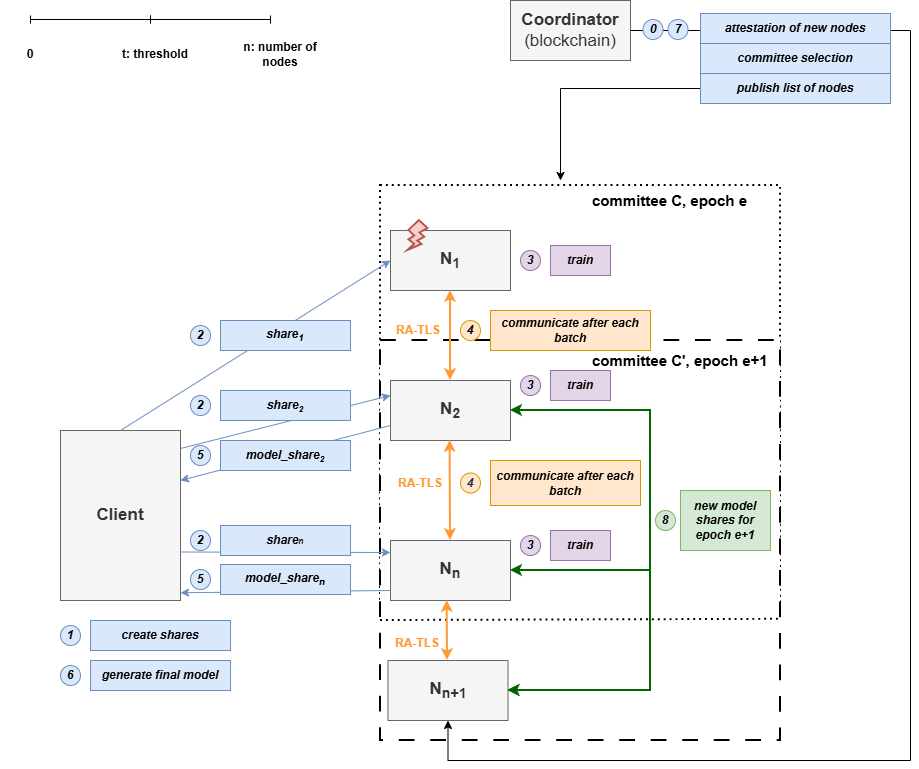

General Design of Sentra
====================================

Overview
========

.. plantuml::

    skinparam BackgroundColor #FFFFFF00

    participant "Sentra Backend" as SentraBackend
    participant "ACME Server (CA)" as Acme
    participant "Sentra Node 1" as SentraNode1
    participant "..." as SentraNodeX
    participant "Stenta Node n" as SentraNodeN

    group Get TLS Certificates
    SentraBackend -> Acme: Certificate Signig Request (CSR)
    SentraNode1 -> Acme: Certificate Signig Request (CSR)
    SentraNodeX -> Acme: Certificate Signig Request (CSR)
    SentraNodeN -> Acme: Certificate Signig Request (CSR)
    Acme -> SentraBackend: Certificate
    Acme -> SentraNode1: Certificate
    Acme -> SentraNodeX: Certificate
    Acme -> SentraNodeN: Certificate
    end

    group Establish GRPC Interface
    activate SentraBackend
    SentraBackend --> SentraBackend: Start GRPC endpoint using provided Certificate
    end

    group Node registration
    SentraNode1 -> SentraBackend: TLS Channel Establishment
    SentraNodeX -> SentraBackend: TLS Channel Establishment
    SentraNodeN -> SentraBackend: TLS Channel Establishment
    SentraBackend -> SentraNode1: Attestion request
    SentraBackend -> SentraNodeX: Attestion request
    SentraBackend -> SentraNodeN: Attestion request
    SentraNode1 -> SentraBackend: Attestion Report
    SentraNodeX -> SentraBackend: Attestion Report
    SentraNodeN -> SentraBackend: Attestion Report
    end

    group Committee selection
    SentraBackend --> SentraBackend: eligibility filtering (based on: trust score, attestation result)
    alt N_candidates < N_target
        SentraBackend -> SentraBackend: return empty candidate set
    end
    SentraBackend --> SentraBackend: committee reuse check
    alt success
        SentraBackend -> SentraBackend: return old committee
    end
    SentraBackend --> SentraBackend: greedy diversity-aware selection on sorted candidate list
    alt success
        SentraBackend -> SentraBackend: return new committee
    end
    end

Architecture Overview
========

   Architecture